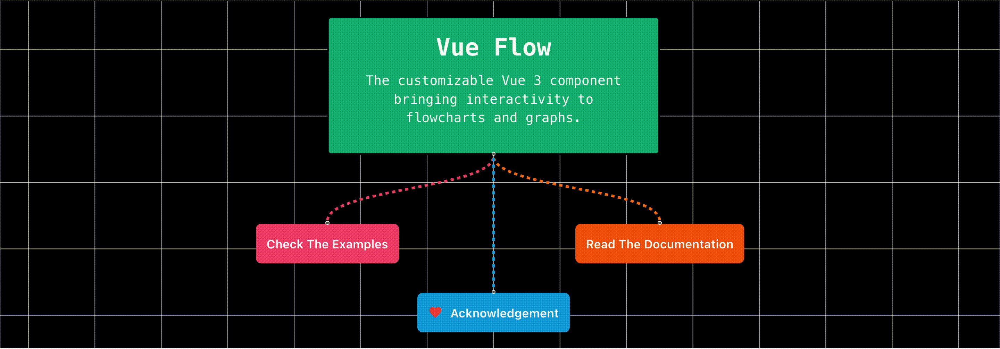

# Vue Flow 🌊

__Check out [VueFlow's Github](https://github.com/bcakmakoglu/vue-flow/blob/master/README.md)__

__Vue Flow: Unstack edges__
This repository is an example on how to display mutliple edges in VueFlow
